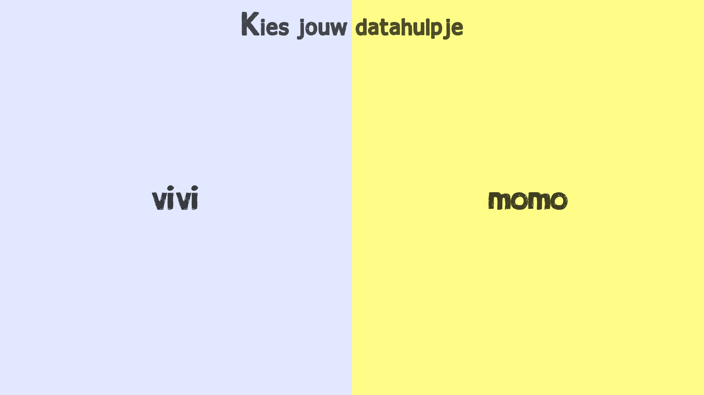

# Het datahulpje

Vaak heb je het niet door, maar op het internet wordt heel veel informatie verstuurd. Ook jij deelt informatie zonder dat je er misschien weet van hebt. Daarom wilt de OBA jou meer inzicht geven over de informatie die de OBA van jouw als lid bewaard. Wil jij weten wat er met jouw informatie gebeurt? Dan is het datahulpje er om jou te helpen.

Het datahulpje neemt je mee in de wereld van informatie. Leer hoe informatie wordt verzameld en hoe je informatie deelt. Leer hoe je informatie aan kan passen en wat je met informatie kan doen. Het datahulpje geeft je een overzicht van jouw informatie, zodat je zelf kunt bepalen wat je met de informatie wil doen.

## Hoe werkt het datahulpje?

Kies eerst jouw eigen datahulpje. Daarna zal het datahulpje met een spel uitleg geven over hoe de OBA informatie verzameld en gebruikt. Dan laat het datahulpje jouw informatie zien en geeft jouw de opdracht om de informatie veilig naar de OBA te sturen. Is de informatie veilig opgeslagen bij de OBA? Dan geeft het datahulpje met een spel uitleg hoe je de informatie kunt aanpassen. Het datahulpje laat daarna de informatie zien die is opgeslagen bij de OBA en geeft het jouw de opdracht om de informatie aan te passen. Weet je hoe je informatie kan versturen en kan aanpassen? Dan krijg je het overzicht van de informatie die de OBA van jouw heeft en een overzicht van boeken die je bij de OBA kunt lenen. Beslis zelf wat de OBA met de informatie mag doen en of de informatie gedeeld mag worden met anderen.

## Features

* Eigen datahulpje kiezen.
* Mini-games over informatie versturen en aanpassen.
* Informatiepagina (Boekenoverzicht & informatieoverzicht).
  * Dynamische optie om informatie aan te passen.
* Aanbevelingenspagina o.b.v. toegestane gedeelde data.
* Overzichtspagina (Aanbevelingenspagina (3/4) links, Informatiepagina (1/4) rechts)
* Chatfunctie (gesprek) per boek. (toegang als boek is geleend)

<!-- Add a link to your live demo in Github Pages 🌐-->

<!-- ☝️ replace this description with a description of your own work -->

<!-- replace the code in the /docs folder with your own, so you can showcase your work with GitHub Pages 🌍 -->

<!-- Add a nice poster image here at the end of the week, showing off your shiny frontend 📸 -->

<!-- Maybe a table of contents here? 📚 -->

<!-- How about a section that describes how to install this project? 🤓 -->

<!-- ...but how does one use this project? What are its features 🤔 -->

<!-- Maybe a checklist of done stuff and stuff still on your wishlist? ✅ -->

<!-- How about a license here? 📜 (or is it a licence?) 🤷 -->
